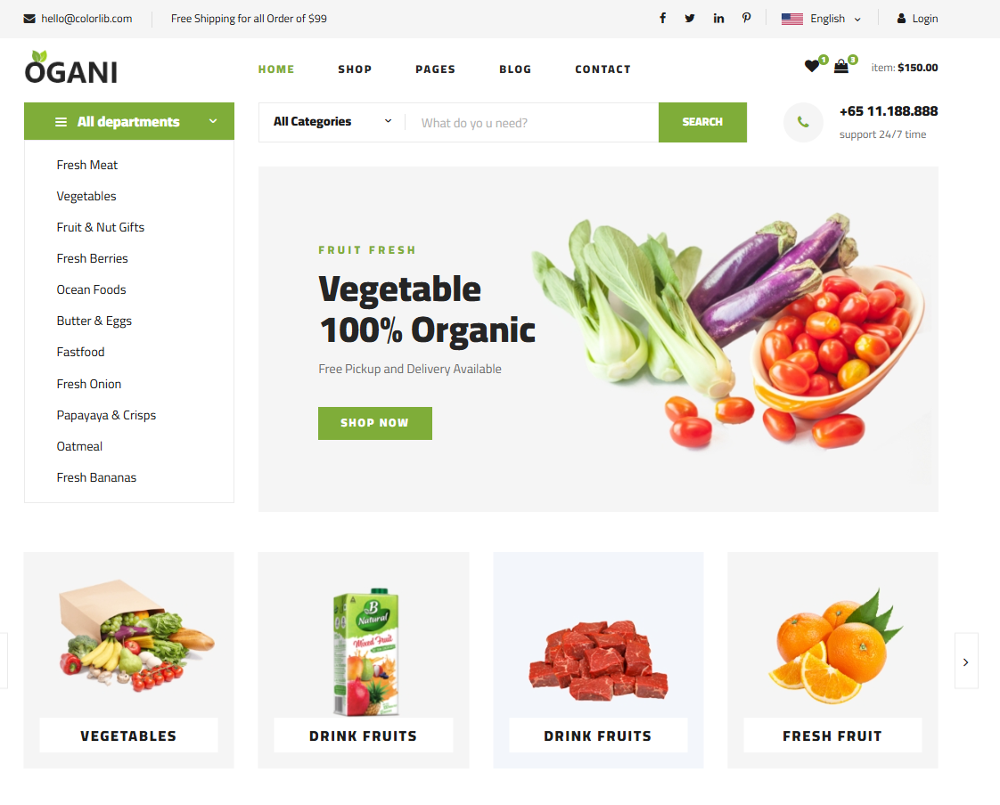
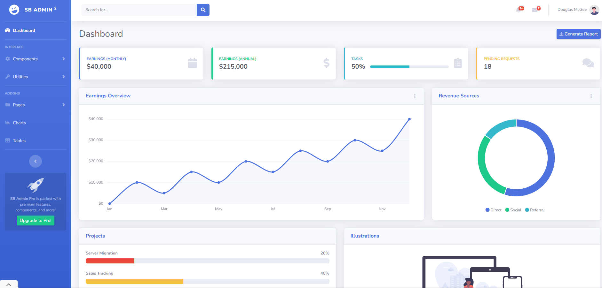

# eCommerce Admin Application

## Objective:
The eCommerce Admin Application is a multi-layered ASP.NET Core solution designed to manage eCommerce operations effectively. This project emphasizes clean architecture, API integration, JWT authentication, and role-based authorization to demonstrate a scalable and professional-grade application.

## Screenshots:

## Features:
- **Multi-layered Architecture**: Includes distinct layers for Data, API, Services, and MVC for separation of concerns.
- **Role-based Authorization**: Supports roles such as Admin, Seller, and Buyer with specific permissions.
- **API Integration**: Utilizes HTTPClient with `IHttpClientFactory` for secure and efficient API communication.
- **JWT Authentication**: Implements cookie-based JWT authentication for secure user access.
- **File Management**: Separate File API for handling uploads and downloads of product and profile images.
- **CRUD Operations**: Comprehensive Create, Read, Update, and Delete actions for managing entities.
- **Validation**: Implements client-side and server-side validations for data integrity.

---

## Development Stages:

### Stage 1: Initial Setup
- Created a class library project, `App.Data`, to manage entities and `DbContext`.
- Defined entities and relationships based on provided schemas.
- Seeded initial data:
  - 3 roles: Admin, Buyer, Seller.
  - 1 admin user and 10 product categories.
- Configured `DbContext` in both eCommerce and Admin MVC projects.
- Verified database creation using `EnsureCreated` method.
- Added `DbContext` dependency injection in controllers.
- Created ViewModels for CRUD operations and added data annotations for validation.
- Integrated server-side and client-side validation.
- Utilized `ViewBag` and `ViewData` for success messages and alerts.
- Enhanced views to display CRUD results using ViewModels.

### Stage 2: Data Repository
- Introduced a generic `DataRepository<TEntity>` class in `App.Data`.
- Updated MVC controllers to utilize repository methods instead of directly accessing `DbContext`.
- Implemented dependency injection for `DataRepository` in both MVC projects.
- Tested all CRUD actions to ensure seamless repository integration.

### Stage 3: Data API Integration
- Added `App.Api.Data` Web API project for handling database operations and JWT token management.
- Migrated database logic from MVC controllers to API endpoints.
- Configured API endpoints for entities such as `Order`, `Profile`, etc.
- Integrated `HttpClient` in MVC projects to interact with API endpoints.
- Implemented JWT token-based authentication for API security.
- Enhanced MVC projects to use tokens for authorization headers in API requests.

#### JWT Authentication:
- Configured JWT Bearer authentication in the API.
- Created an `AuthController` for token generation based on email and password.
- Tested token generation and validation using Postman and jwt.io.

#### Role Management:
- Restricted access to API endpoints using role-based authorization.
- Customized menus and views in MVC projects to display options based on user roles.

### Stage 4: File API Integration
- Added `App.Api.File` Web API project for managing file uploads and downloads.
- Developed:
  - `Upload` endpoint for saving files.
  - `Download` endpoint for serving files on demand.
- Updated MVC projects to use File API for product and profile images.
- Tested file upload and retrieval functionalities for various scenarios.

### Stage 5: Service Layer and IHttpClientFactory
- Introduced `App.Services` class library for business logic.
  - Organized into `Abstract` (interfaces) and `Concrete` (implementations) layers.
- Created `App.Models.DTO` library for data transfer objects.
- Refactored MVC and API projects to delegate business logic to service methods.
- Implemented `IHttpClientFactory` for efficient and reusable HTTP client handling.
- Used `Ardalis.Result` library for standardized service responses.

---

## Technologies Used:
- **Framework**: ASP.NET Core
- **Database**: Entity Framework Core with SQL Server
- **Authentication**: JWT Bearer Authentication
- **Validation**: Client-side and Server-side
- **Dependency Injection**: Built-in DI container
- **HTTP Client**: IHttpClientFactory for API communication
- **UI Framework**: Bootstrap
- **Tools**: Postman for API testing

---

## Project Structure

In this project, each module is organized independently with its own responsibilities. Below is the structure:

| Folder             | Description                                                           |
|--------------------|-----------------------------------------------------------------------|
| **App.Data**       | Entity Framework models and DbContext                                 |
| **App.Api.Data**   | Database operations and authentication API                            |
| **App.Api.File**   | File management API                                                   |
| **App.Services**   | Business logic services (divided into Abstract and Concrete)          |
| **App.Models.DTO** | Data Transfer Objects (DTOs)                                          |
| **eCommerce MVC**  | Frontend for buyers and sellers                                       |
| **Admin MVC**      | Admin panel                                                           |

### Folder Descriptions

- **App.Data**: Contains Entity Framework models and DbContext for database operations.
- **App.Api.Data**: Handles database API and authentication processes.
- **App.Api.File**: Provides API services for file management.
- **App.Services**: Contains the business logic services, split into `Abstract` and `Concrete` classes.
- **App.Models.DTO**: Holds the Data Transfer Objects (DTOs) used for data transfer.
- **eCommerce MVC**: Frontend application developed for buyers and sellers.
- **Admin MVC**: Admin panel for managing the system.

---

## How to Run:
1. Clone the repository.
2. Configure connection strings in `appsettings.json` for all projects.
3. Apply migrations using `Update-Database` in the `App.Data` project.
4. Run `App.Api.Data` and `App.Api.File` APIs.
5. Start the eCommerce and Admin MVC projects.

---

## Future Enhancements:
- Add unit tests for controllers and services.
- Improve UI/UX with additional features.
- Implement caching for frequent API calls.

